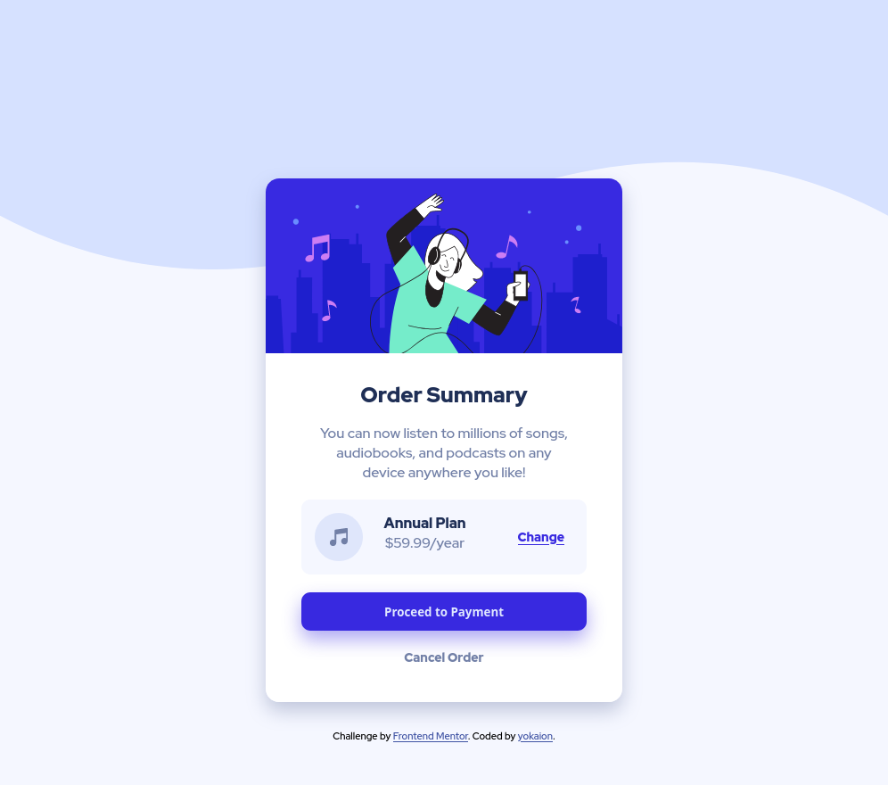

# Frontend Mentor - Order summary card solution

This is a solution to the [Order summary card challenge on Frontend Mentor](https://www.frontendmentor.io/challenges/order-summary-component-QlPmajDUj). Frontend Mentor challenges help you improve your coding skills by building realistic projects. 

## Table of contents

- [Overview](#overview)
  - [The challenge](#the-challenge)
  - [Screenshot](#screenshot)
  - [Links](#links)
- [My process](#my-process)
  - [Built with](#built-with)
  - [What I learned](#what-i-learned)
  - [Continued development](#continued-development)
  - [Useful resources](#useful-resources)
- [Author](#author)
- [Acknowledgments](#acknowledgments)

## Overview

### The challenge

Users should be able to:

- See hover states for interactive elements

### Screenshot

### Links

- Solution URL: [Add solution URL here](https://your-solution-url.com)

## My process

### Built with

- Semantic HTML5 markup
- CSS custom properties
- Flexbox

### What I learned

I have practiced CSS Flexbox. Particulary, flex-direction, justify-content, align-items, and flex-shrink. 

I have also learned how to import Google Fonts and link favicons. 

### Continued development

In the future projects, I would like to focus more on the following:

- CSS Grid
- Writing semantically correct and clean HTML&CSS

### Useful resources

- [A Complete Guide to Flexbox](https://css-tricks.com/snippets/css/a-guide-to-flexbox/) - This article helped me with understanding and implementation of Flexbox. Great examples and visuals.
- [How to Import Google Fonts in CSS File](https://www.w3docs.com/snippets/css/how-to-import-google-fonts-in-css-file.html) - This helped me understand how to include Google Fonts in my CSS file.

## Author

- Frontend Mentor - [@yokaion](https://www.frontendmentor.io/profile/yokaion)
- GitHub - [yokaion](https://github.com/yokaion)

